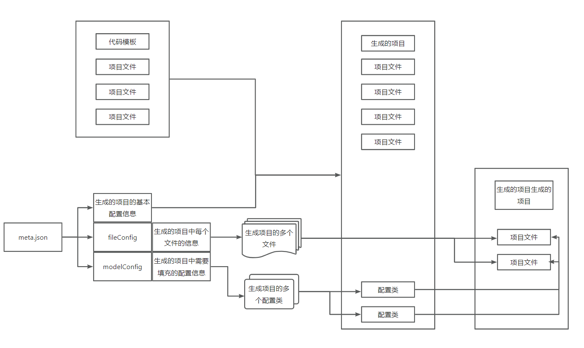
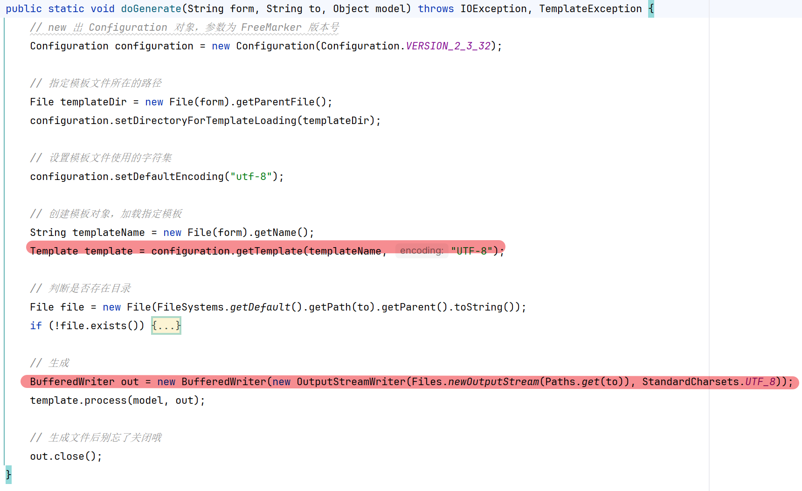
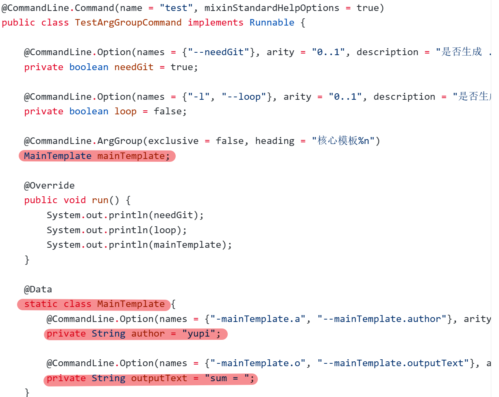
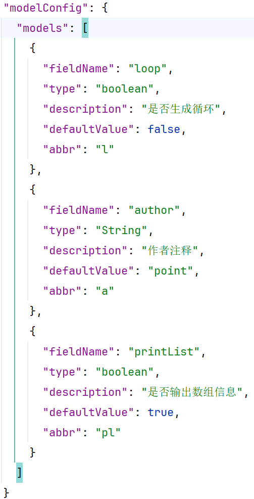
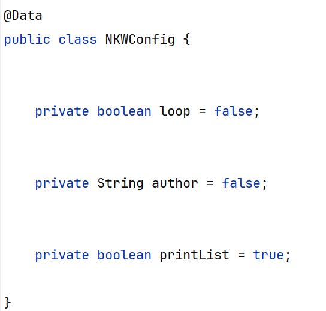
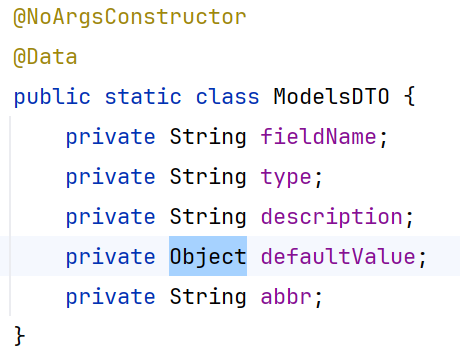

### base-code-generator-pro

##### meta.json的作用

- 使用meta.josn来生成元信息->可以使用配置文件来配置要生成项目的信息
  - meta.json中,有fileConfig,其中的files为需要生成的项目的文件信息数组
    - 有fileConfig描述项目的信息,files描述单个文件的信息
  - meta.json中,有modelConfig,其中的models为填充需要生成项目的配置类信息
    - 注意models,使用gsonformatplus生成类时,defaultValue有两种类型,生成时只生成第一种类型
- 解决使用生成代码生成的代码的乱码问题

- 自动执行maven命令打包
- 自动生成win执行脚本
- 在生成项目中生成.ignore
- 在生成项目中生成README

- 提高代码的可移植性
  - 在meta.json中添加sourceRootPath字段
  - 然后在程序中将代码模板项目从sourceRootPath中复制到inputRootPath中
  - 再进行项目的处理
  - sourceRootPath 为模板项目的rootPath--需要带项目名
  - inputRootPath 暂时存放模板项目的路径，为生成最终项目的模板项目来源路径--需要带项目名
  - outputRootPath 为输出最终模板项目的路径--不用带项目名
  - sourceRootPath 末尾的项目名需要与inputRootPath末尾的项目名一致
- 增加项目的介绍
  - 做一个README.md的模板
- 简化代码，优化生成代码的空间
  - 删除生成代码的源代码，target，pom.xml文件，只留下jar包和执行的脚本文件
- 提高代码的健壮性
  - 校验meta.json中的属性是否符合要求
  - 自定义异常类
- 降低代码的圈复杂度
- 提高代码的可扩展性
  - 在项目中抽出常量值
  - 使用模板方法模式

- 控制单个文件生成
  - 在meta中加入对应的数组，加入condition来判断条件是否成立
  - 在meta文件的model加入needgit字段，判断是否需要生成ignore文件
  - 在meta文件中的files加入condition字段判断条件是否成立
  - 修改对应的对象类
- 在项目中需要取到model中的属性，但是Boolean和String的取值方法不一样
  - boolea为isxxx
  - String为getxxx
  - 解决方法：将所有的属性都修改为public，直接取到属性值，而不是通过getter

- 一个参数控制多个文件生成
  - 在files中加入分组的group字段和condition字段
  - files中的一个file可以有group，也可以没有
  - 将file中的condition字段删除
  - 在有group字段的类file中，可以在嵌套多个file

- 实现用户输入参数的隔离
  - 对model中的参数进行分组，加入group等字段
  - 校验的修改
  - 实现当用户输入-l为true时，才触发开启-a和-pl 的输入
  - 在model类中，建立一个内部类，分组的信息为类的信息，组内的model属性为类中的字段

### 模板方法模式
- 将代码抽象为多个顺序执行的流程，每个流程可以由一个方法实现
- 这里将流程抽象为
  - 移动模板项目代码
  - 动态生成代码生成器
  - 使用maven打包
  - 编写脚本
  - 代码空间优化
- 这里模板类为 GenerateTemplate，为生成代码生成器的模板，有模板流程
- 创建 GenerateCode 继承 GenerateTemplate，可以重写 GenerateTemplate 中的模板方法
- 在main中使用的时 GenerateCode 的方法

### bug
在meta.json中,modelConfig的models的defaultValue有两种类型:String和boolea

读取meta.json中的元信息,author为String,但是生成的结果默认值为Boolean

原因:使用GsonFormatPlus插件生成的可能只识别第一个defaultValtiue的类型,然后创建meta类时,将defaultValue的类型赋值为boolean
解决方法:将meta类中的defaultValue类型扩大,修改为Object

