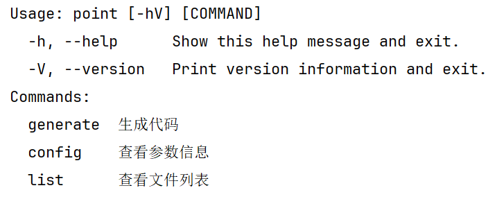
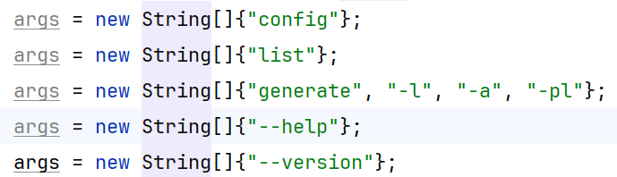
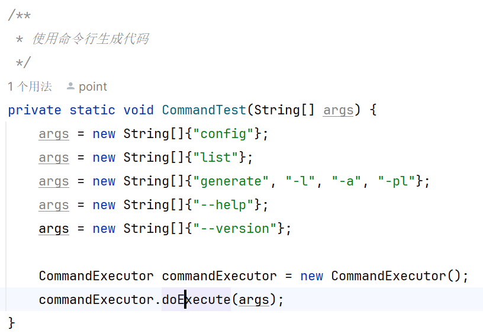

### base-code-generator

- 牛客网的代码生成器静态
- 牛客网的代码生成器动态
  - 是否生成循环
  - 是否生成输出数组的函数
  - 是否输出作者
- 动态模板生成思路
  - 使用freemarker对模板代码进行挖空
  - 创建model对象文件，对挖空的部分抽为属性
  - 使用FreeMarker对挖空的部分进行填充
  - 注意在生成文件时，目录的空处理

### 代码片段

> File file = new File(FileSystems.getDefault().getPath(to).getParent().toString());

> file.mkdirs();

> FileUtil.copy(from, to, false);

### bug
报错找不到文件：

解决方法：在输出文件时，需要输出对应文件的名称，不能只输出文件夹

- 使用命令行来执行代码的生成
  - config 输出填充模板配置类的所有属性
  - list 输出模板项目的树形目录
  - generate 进入交互界面，输入需要的配置信息并生成模板项目

### 命令模式-基于picocli的
- 命令：args，从命令行中输入的参数

- 具体命令：ConfigCommand  GenerateCommand  ListCommand 对args中命令参数的实现
- 接受者：有点随意，这里没有向具体命令的类中传入参数，一般来说会向具体命令的类中传入参数
- 调用者：CommandExecutor
- 客户端：CommandTest

